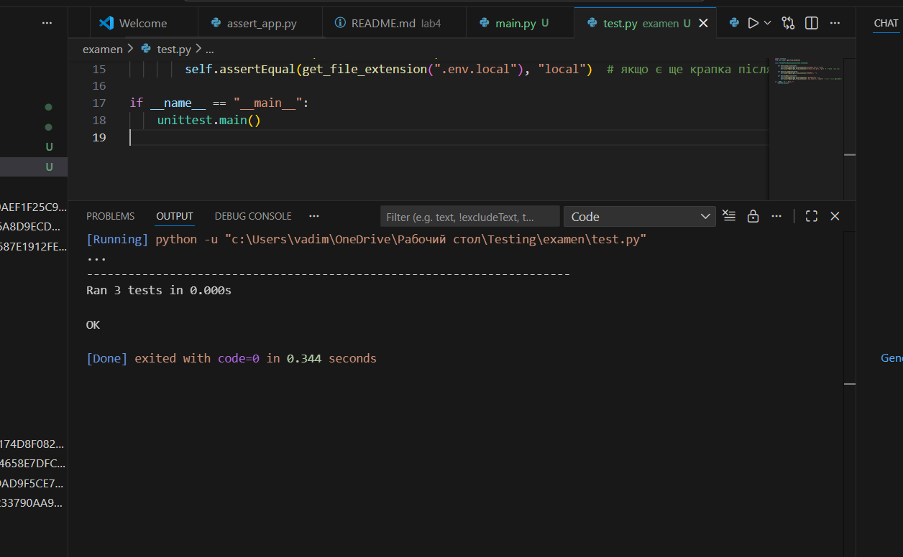

# Екземенаційний білет 22

№№ Практичне завдання
Завдання: У файлі main.py створіть функцію get_file_extension(filename: str), яка повертає розширення файлу (частину після останньої крапки). Тест: У файлі test.py перевірте файли з розширенням, без розширення та приховані файли (починаються з крапки).
```
Python test.py

```
