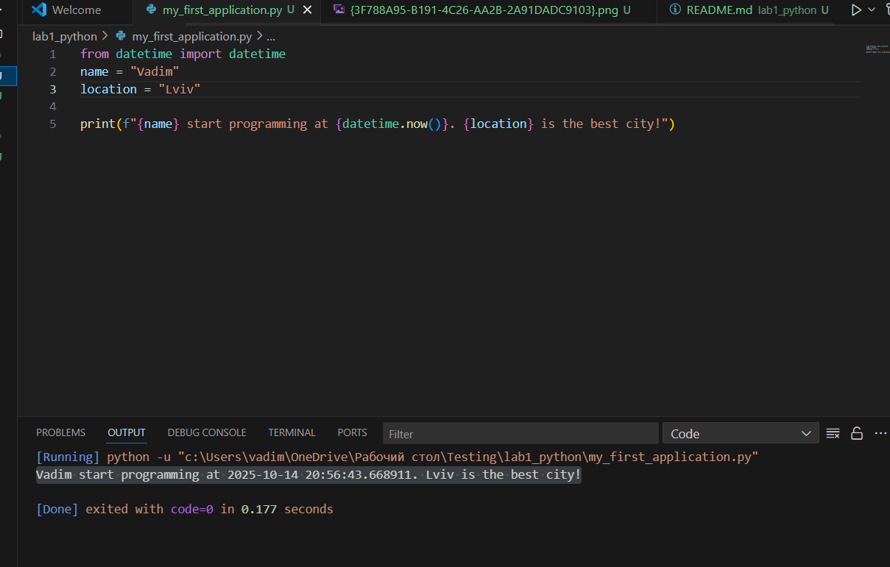
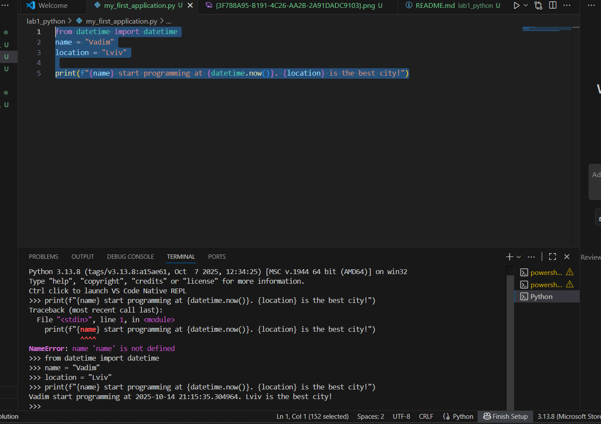
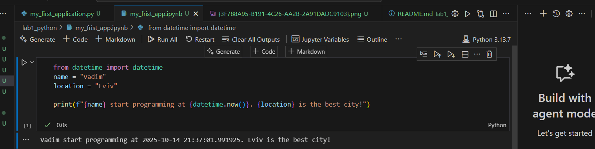

# Звіт до роботи
## Тема: Вступні заняття: налаштування середовища, прочаток роботи з Python та Markdown
### Мета роботи: Налаштувати середовище роботи VS Code, створити репозиторій Github та налаштувати інтеграцію з ним, написати першу програму на Python та створити звіт з використанням форматування Markdown;

---
### Виконання роботи
* Результати виконання завдання *1...N*;
    1. Розробили/Створили ...
    1. Програма вивела значення: Vadim start programming at 2025-10-14 20:56:43.668911. Lviv is the best city!
    1. Отримав наступні результати: Програма працює правильно,код спрацював у всіх методах виклику:<<Terminal,bash,jupyter>> файл з розширенням <<ipynb>> також вивів результат
    1. Навчився налаштоувати середовище робиоти VS Code та створювати репозиторії в Github
* вставлені рисунки 
    
    

* вставлений код / текстовий або числовий результат / інші результати:
    - from datetime import datetime
name = "Vadim"
location = "Lviv"

print(f"{name} start programming at {datetime.now()}. {location} is the best city!");

* результати виконання індивідуального завдання (якщо такі є);

---
### Висновок:
> у висновку потрібно відповісти на запитання:

- :question: Що зроблено в роботі;
- :question: Чи досягнуто мети роботи;
- :question: Які нові знання отримано;
- :question: Чи вдалось відповісти на всі питання задані в ході роботи;
- :question: Чи вдалося виконати всі завдання;
- :question: Чи виникли складності у виконанні завдання;
- :question: Чи подобається такий формат здачі роботи (Feedback);
- :question: Побажання для покращення (Suggestions);

---
