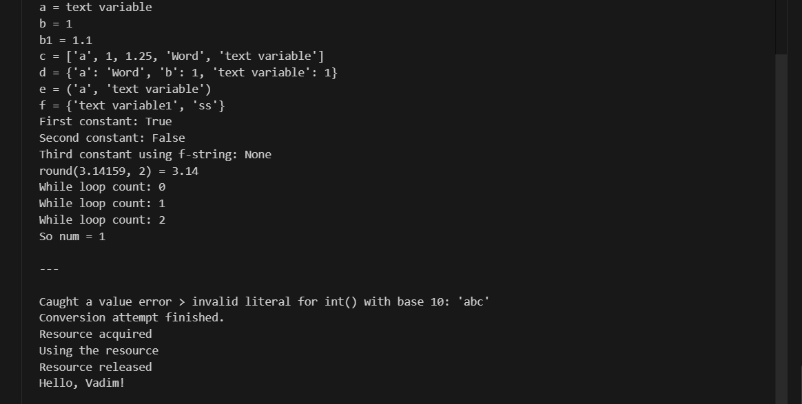
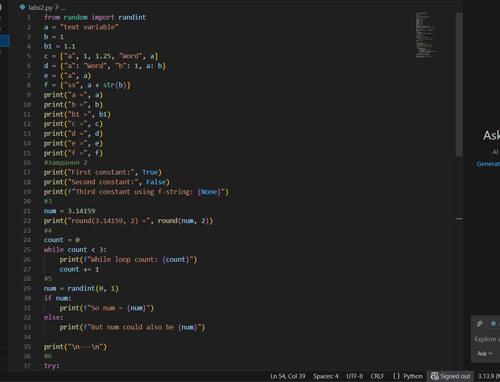

# Звіт до роботи
## Тема: Основи програмування Python
### Мета роботи:Навчитись застосовувати основні конструкції мови Python, виконати всі приклади та з використанням AI створити власні приклади, які демонструють особливості кодових конструкцій Pyhton


---
### Виконання роботи
* Результати виконання завдання *1-8*;
    1. Програма вивела значення: 
    1. Отримав наступні результати: Програма працює правильно,код спрацював у всіх методах виклику
    1. Ознайомився та навчився використовувати основні конструкціїї мови Python,виконкав всі поставлені завдання,а також створив приклади від ШІ,які демонструють особливості кодових конструкцій Python
* вставлені рисунки  
    

* вставлений код / текстовий або числовий результат / інші результати:
    First constant: True
Second constant: False
Third constant using f-string: None

* результати виконання індивідуального завдання (якщо такі є);

---

### Про основи програмування на Python від ШІ

> Запитання: Запитайте у АІ як би він розписав про основи Python (задайте промпт вказавши що ви вивчаєте Python з використанням Jupyter Notebook). Спробуйте виконати приклади Python коду та вставте їх відповіді у звіт?

```
Основи синтаксису

Python не потребує крапок з комою для закінчення рядків.

Відступи (4 пробіли) визначають блок коду.

Коментарі:

# Це коментар


Можна використовувати магнітні рядки у Jupyter:

"""
Це багаторядковий коментар
або документація
"""

2. Змінні та типи даних

Python динамічно визначає тип змінної:

a = 10        # int
b = 3.14      # float
name = "Vadim" # str
flag = True    # bool

# Колекції
my_list = [1, 2, 3]       # list
my_tuple = (1, 2, 3)      # tuple
my_set = {1, 2, 3}        # set
my_dict = {"a": 1, "b": 2} # dict

3. Оператори

Арифметичні: + - * / % // **

Порівняння: == != > < >= <=

Логічні: and, or, not

x = 5
y = 2
print(x + y, x ** y, x // y)
print(x > y and y < 10)

4. Умовні конструкції
age = 18
if age >= 18:
    print("Adult")
elif age > 12:
    print("Teenager")
else:
    print("Child")


В Jupyter зручно писати тернарні оператори:

status = "Adult" if age >= 18 else "Minor"
print(status)

5. Цикли

for — ітерує елементи колекцій:

for i in range(5):
    print(i)

fruits = ["apple", "banana"]
for fruit in fruits:
    print(fruit)


while — виконує поки умова істинна:

count = 0
while count < 3:
    print(count)
    count += 1

6. Функції та лямбди
# Звичайна функція
def greet(name):
    return f"Hello, {name}!"

print(greet("Vadim"))

# Lambda-функція
square = lambda x: x**2
print(square(5))

7. Обробка виключень
try:
    print(10 / 0)
except ZeroDivisionError as e:
    print("Error:", e)
finally:
    print("Always executes")

8. Робота з файлами (контекст-менеджери)
with open("example.txt", "w") as f:
    f.write("Hello Jupyter!")

with open("example.txt", "r") as f:
    print(f.read())

9. Бонус для Jupyter

Можна виконувати клітинки по черзі, змінювати змінні і одразу бачити результат.

Підтримка Markdown дозволяє красиво документувати код:

# Заголовок
**Жирний текст**


Можна вбудовувати графіки через matplotlib або seaborn:

import matplotlib.pyplot as plt
plt.plot([1,2,3], [4,5,6])
plt.show()

"""
Це
багаторядковий
коментар
"""
```
### Висновок:
> ---
## 1. Що зроблено в роботі
- Вивчено основні типи даних у Python: `int`, `float`, `str`, `bool`, `list`, `tuple`, `dict`, `set`.  
- Попрактикувались у роботі з умовними конструкціями (`if`, `elif`, `else`).  
- Виконано приклади циклів `for` та `while`.  
- Ознайомились із лямбда-функціями та вбудованими функціями (`abs`, `len`, `round`).  
- Реалізовано приклади роботи з файлами через контекст-менеджер `with`.  
- Відпрацьовано конструкції обробки помилок `try → except → finally`.  
- Створено власні приклади коду з використанням AI для демонстрації можливостей Python.  

## 2. Чи досягнуто мети роботи
Так, мета роботи досягнута: освоєні базові конструкції мови Python, виконані всі приклади та створені власні демонстраційні приклади коду.

## 3. Які нові знання отримано
- Розуміння основних типів даних та структур у Python.  
- Навички роботи з циклами та умовними конструкціями.  
- Вміння створювати та використовувати лямбда-функції.  
- Знання про обробку помилок та роботу з файлами.  
- Практика інтеграції AI для генерації власних прикладів коду.  

## 4. Чи вдалося відповісти на всі питання, задані в ході роботи
Так, всі питання щодо типів даних, циклів, умовних конструкцій, функцій та обробки помилок були опрацьовані.

## 5. Чи вдалося виконати всі завдання
Так, всі лабораторні приклади та додаткові завдання були успішно виконані.

## 6. Чи виникли складності у виконанні завдання
- На початку виникли незначні труднощі із синтаксисом лямбда-функцій та використанням модуля `random` (`randint`).  
- Усі проблеми були успішно усунені під час виконання завдання.  

## 7. Чи подобається такий формат здачі роботи (Feedback)
Так, формат з поетапним виконанням прикладів у Jupyter Notebook та використанням AI для створення власних прикладів дуже зручний і наочний.

## 8. Побажання для покращення (Suggestions)
- Додати більше практичних завдань на комбінування різних конструкцій (цикли + умовні оператори + словники).  
- Включати короткі пояснення для кожного прикладу безпосередньо у ноутбуку для кращого розуміння.  
- Додати вправи на використання модулів і бібліотек Python для практики реальних задач.
