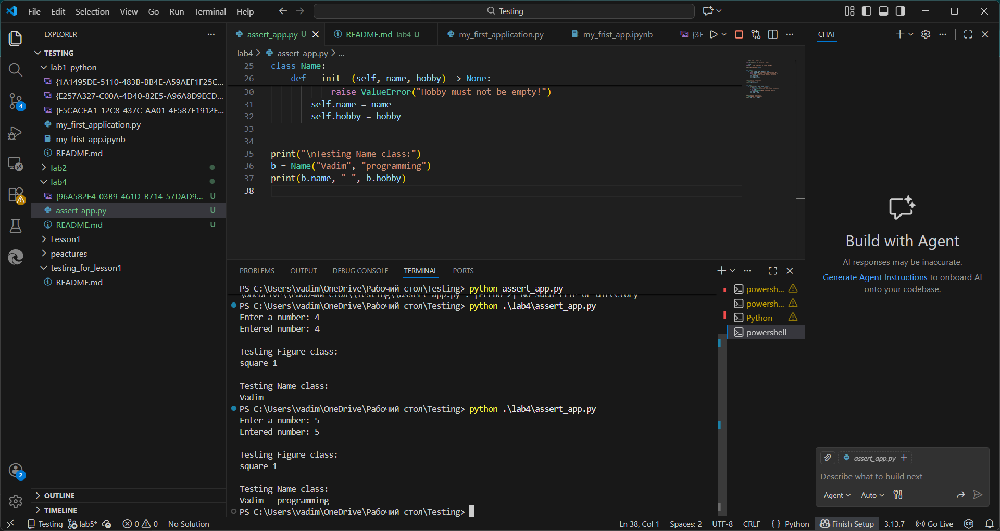
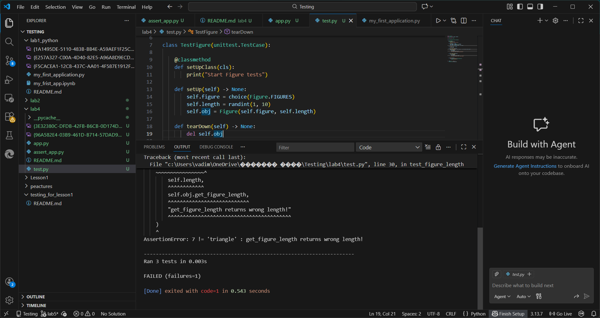
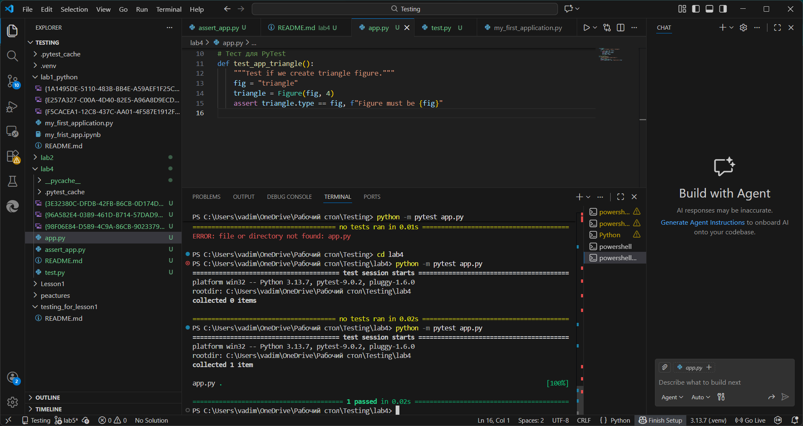

# Звіт до роботи
# Тема лабораторної роботи
Розробка класів на Python, валідація даних за допомогою assert, написання юніт-тестів та оцінка покриття коду (Coverage) з використанням unittest та pytest.

# Мета лабораторної роботи
Навчитися створювати класи в Python з валідацією аргументів, розробляти юніт-тести для перевірки їх функціональності, використовувати бібліотеки `unittest` та `pytest` для тестування, а також аналізувати покриття коду тестами за допомогою `pytest-cov` та `coverage`.

---
### Виконання роботи
* Результати виконання завдання *4*;
    1. Розробивпроєкт для перевірки коду та тестування в Python,
    1. 
    1. Отримав наступні результати: Програма працює правильно,код спрацював у всіх методах виклику:<<Terminal,bash,jupyter>> файл з розширенням <<ipynb>> також вивів результат
    1. Навчився налаштоувати середовище робиоти VS Code та створювати репозиторії в Github
* вставлені рисунки:

      
  Тест з помилкою ,як приклад: 
  

  останнє завдання

    

* вставлений код / текстовий або числовий результат / інші результати:
    -class Figure:
    FIGURES = ["triangle", "square", "rectangle"]

    def __init__(self, type, length):
        assert length > 0, "Length must be greater than 0"
        assert type in self.FIGURES, f"Allowed figures: {', '.join(self.FIGURES)}"
        self.type = type
        self.length = length

    @property
    def get_figure_type(self):
        return self.type

    @property
    def get_figure_length(self):
        return self.length  # виправлено помилку

    @property
    def get_angles(self):
        if self.type in ["square", "rectangle"]:
            return 4
        if self.type == "triangle":
            return 3

* результати виконання індивідуального завдання (якщо такі є);

---

### Перша програма штучного інтелекту (ChatGPT)

### Висновок:

- - **Що зроблено в роботі:** створено програми на Python для перевірки assert, розроблено класи `Figure` та `Name` з валідацією аргументів, написано юніт-тести для класу `Figure` з використанням бібліотек `unittest` та `pytest`, реалізовано тестування властивостей класу, проведено аналіз покриття коду з бібліотекою `pytest-cov` та згенеровано HTML-звіт покриття.  

- **Чи досягнуто мети роботи:** так, усі тести пройшли успішно, властивості класів працюють коректно, покриття коду досягло 100%.  

- **Які нові знання отримано:** робота з assert для валідації даних у Python, написання юніт-тестів з `unittest` та `pytest`, використання параметра `--cov` для аналізу покриття коду, генерація HTML-звітів з `coverage`, організація тестів та перевірка правильності виконання коду.  

- **Чи вдалось відповісти на всі питання задані в ході роботи:** так, всі завдання лабораторної виконані, тести перевірили правильність роботи коду, покриття коду підтвердило повне тестування.  

- **Чи вдалося виконати всі завдання:** так, включно з додаванням нової проперті `get_angles` та перевіркою її тестами.  

- **Чи виникли складності у виконанні завдання:** незначні труднощі з запуском `pytest` на Windows, які були швидко усунуті.  

- **Чи подобається такий формат здачі роботи (Feedback):** так, інтеграція коду, тестів та покриття у одному проєкті дуже наочна і цікава.  

- **Побажання для покращення (Suggestions):** додати більше прикладів тестування різних класів і методів, розширити вправи з покриттям коду та візуалізацією результатів у HTML.

